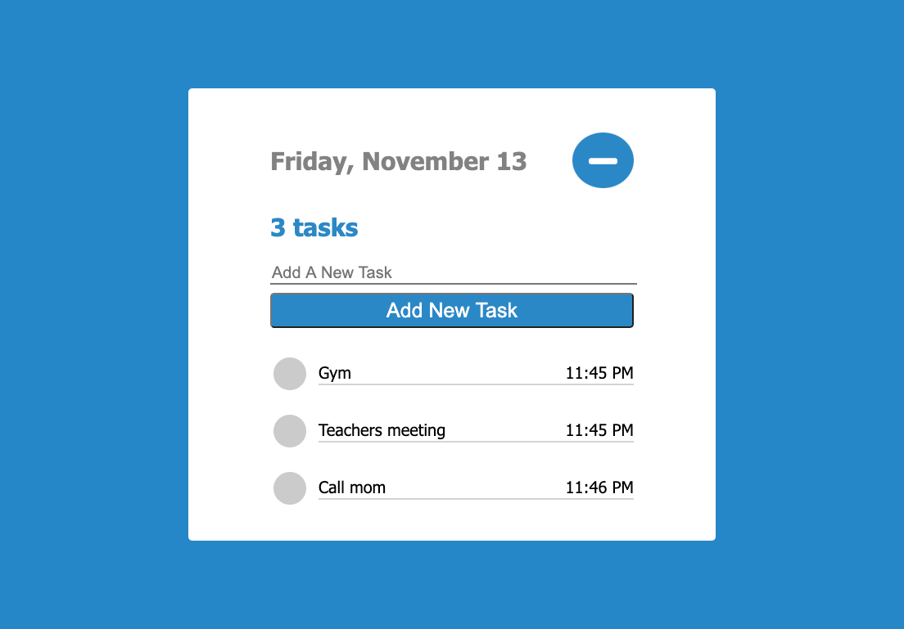
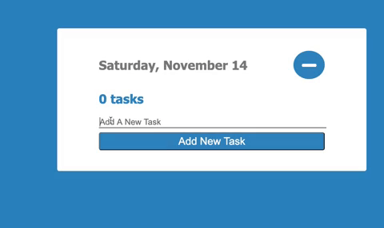
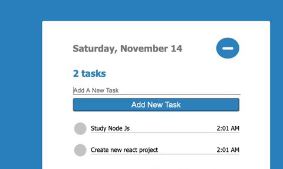

<h1 align="center">TASK APP</h1>
<h2 align="center">

</h2>

<p align="center">
  


</p>



<h2 align="center"><a  href="https://aneudy-todo.netlify.app/">Live Demo</a></h2>

### [Contributions are Welcome](https://github.com/aneudya4/movie-app.git)

## Description

<p align="center">
</p>
 Productivity app built with Html CSS and Vanilla Javascript, allows user to keep track of their task and delete them when completed.Added local Storage to make the data persits after refreshing or revisiting the app in the same web browser the
 task were added.

## How to Add

- **START** Type movie name into input box
- **choose and submit** Click enter or add task button.

## How to Delete

- **START** Click gray circle checkbox of done task
  </p>

## Project setup:

```bash
git clone https://github.com/aneudya4/todo-test.git
cd todo-test
npm install
npm  start
```
